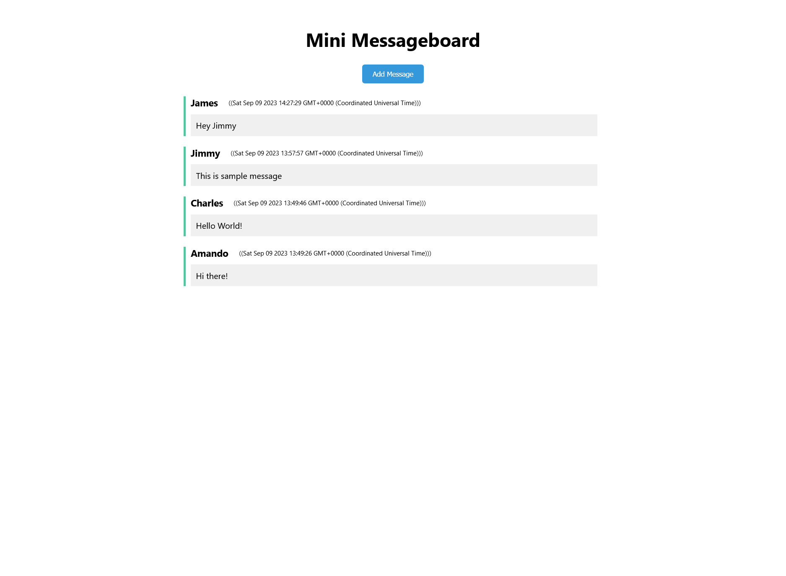

# Mini Message Board - Your Simple Messaging App

#### Visit the Mini Message Board: [Mini Message Board App](https://mini-message-board-6fmb.onrender.com/)



## Description

Mini Message Board is a lightweight and easy-to-use messaging application that allows users to post and view messages. Whether you want to leave a quick note or have a conversation, our app makes it simple and straightforward.

## Features

-   **Post Messages**: Share your thoughts, updates, or questions with others through messages.
-   **View Messages**: Scroll through the list of messages to see what others are discussing.

-   **Timestamps**: Each message includes a timestamp to indicate when it was posted.

-   **Clean Interface**: Our user-friendly interface ensures a hassle-free messaging experience.

-   **Responsive Design**: Access the app on various devices, including desktop and mobile.

## Installation

### Prerequisites

-   Node.js installed on your machine
-   MongoDB installed / MongoDB Atlas Cloud Account

1. Clone the repository:

    ```bash
    git clone https://github.com/karprabha/mini-message-board
    ```

2. Navigate to the project directory:
    ```bash
    cd mini-message-board
    ```
3. Install dependencies:
    ```bash
    npm install
    ```
4. Create .env file in root dir and add follwing code in it
    ```bash
    MONGODB_URI=mongodb://127.0.0.1:27017/mini-message-board
    ```
    or
    ```bash
    MONGODB_URI=<mongoDB atlas URI>/mini-message-board
    ```
5. Start the development server:
    ```bash
    npm run serverstart
    ```

## Technologies Used

-   "Node.js"
-   "Express.js"
-   "Pug" (for views)
-   "SCSS" (for styling)
-   "MongoDB" (Mongoose ODM)

## Contributing

Contributions are welcome! If you'd like to contribute to the project, please follow these steps:

-   Fork the repository.
-   Create a new branch for your feature or bug fix.
-   Make your changes and commit them with descriptive commit messages.
-   Push your changes to your forked repository.
-   Create a pull request to the original repository's 'main' branch.

## Credits

This project was made possible with the contributions of various resources and individuals:

-   **Freepick**: High-quality favicon used for app.
